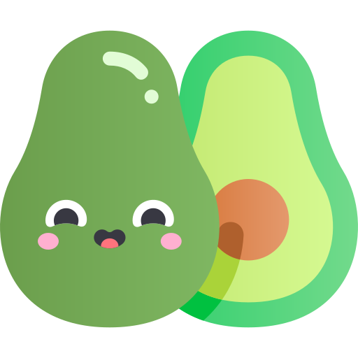

<p align="center">
   
</p>


# Avo-can do!

> Avo-can do! created using ReactJS(web) and React Native(mobile)

<p align="center"></p>
<p align="center"></p>


### Installation(web)

Get in the project's path , then install the dependencies with:

```sh
yarn
```

Start it with:

```sh
yarn start
```

### Installation(mobile)

Get in the project's path , then install the dependencies with:

```sh
yarn 
```

Start it with:

- Android:
```sh
yarn android
```
- iOS:

```sh
yarn ios
```

## Author

  **Guilherme Azevedo dos Santos**

* Github: [@g-asantos](https://github.com/g-asantos)
* Linkedin: [@guilherme-azevedo-dos-santos-417a70159](https://www.linkedin.com/in/guilherme-azevedo-dos-santos-417a70159/)

## License

[MIT](https://choosealicense.com/licenses/mit/)
